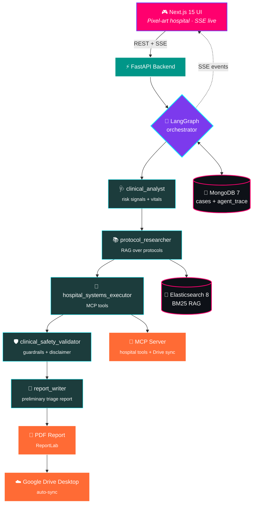

<div align="center">

# 🏥 Hospital Triage AI

### Multi-agent clinical triage decision support — *real-time pixel-art hospital, live LangGraph observability*

[](https://www.python.org/)
[](https://fastapi.tiangolo.com/)
[](https://langchain-ai.github.io/langgraph/)
[](https://nextjs.org/)
[](https://www.typescriptlang.org/)
[](https://www.mongodb.com/)
[](https://www.elastic.co/)
[](https://modelcontextprotocol.io/)
[](https://docs.docker.com/compose/)
[](LICENSE)

</div>

---

> ⚠️ **Solo soporte a la decisión clínica.** Este sistema no emite diagnósticos médicos. La decisión médica final pertenece siempre al profesional sanitario.

## ✨ ¿Qué hace?

MVP de orquestación de IA multiagente para soporte a la decisión clínica en el triaje de urgencias hospitalarias.

- 🧠 **6 agentes LangGraph encadenados** — orchestrator → clinical_analyst → protocol_researcher → MCP executor → safety_validator → report_writer.
- 🎮 **Hospital pixel-art en tiempo real** — cada agente se anima según su estado vía SSE. La UI **no** es decoración: es observabilidad de LangGraph.
- 📚 **RAG sobre protocolos clínicos** — Elasticsearch + BM25.
- 🔌 **Servidor MCP local** — herramientas hospitalarias simuladas + sync de informes a Google Drive sin tocar OAuth.
- 📄 **Informe PDF auto-generado** + entrega vía MCP a carpeta Drive Desktop sincronizada.
- 🎫 **Integración Jira opcional** — cada caso crea un ticket, comentarios automáticos en hitos.

## 🎯 Demo flow

```
Paciente UI → FastAPI → LangGraph orchestrator
                         │
            ┌────────────┴────────────┐
            ▼                         ▼
     Clinical Analyst        Protocol Researcher (RAG)
            │                         │
            └────────────┬────────────┘
                         ▼
            Hospital Systems (MCP tools)
                         ▼
              Safety Validator (guardrails)
                         ▼
                  Report Writer
                         ▼
                Informe PDF + Drive sync

---

## 1. Stack

| Capa         | Tecnología                                                                   |
|--------------|------------------------------------------------------------------------------|
| Frontend     | Next.js 15 (App Router) + React + TypeScript + Tailwind + Zustand + Anime.js |
| Backend      | Python 3.11 + FastAPI + LangGraph + LangChain + sse-starlette + ReportLab    |
| Persistencia | MongoDB 7 (driver asíncrono Motor)                                           |
| RAG          | Elasticsearch 8 (BM25 sobre protocolos médicos)                              |
| Herramientas | Servidor MCP local (herramientas hospitalarias simuladas + sync Drive Desktop) |
| Exportación  | PDF → MCP `send_report_to_drive` → carpeta sincronizada por Google Drive Desktop |
| Infra        | Docker Compose (5 servicios, con healthcheck)                                |

---

## 2. Arquitectura



### Agentes LangGraph (secuenciales)

1. `triage_orchestrator` — recibe el caso, delega.
2. `clinical_analyst` — extrae señales de riesgo de síntomas + constantes vitales.
3. `protocol_researcher` — RAG sobre protocolos en Elasticsearch.
4. `hospital_systems_executor` — llama a herramientas MCP (pruebas, recursos, tiempo de espera).
5. `clinical_safety_validator` — aplica reglas de seguridad + descargo.
6. `report_writer` — compone el informe preliminar de soporte al triaje.

Cada nodo añade `{agent_id, status, message, timestamp}` a `agent_trace` y emite un evento SSE al frontend.

---

## 3. Requisitos previos

- **Docker Desktop** (Windows/Mac) o Docker Engine + Compose v2 (Linux). Debe soportar el subcomando `docker compose`.
- ~4 GB de RAM libre (solo Elasticsearch reserva 512 MB de heap).
- Puertos TCP libres: `3000`, `7800`, `8000`, `9200`, `27017`.
- Credenciales del gateway LLM (proxy compatible con OpenAI — NextAI / Azure / OpenAI).
- **Google Drive Desktop** instalado en Windows (o equivalente en macOS) sincronizando una carpeta local. La ruta de esa carpeta va en `DRIVE_SYNC_FOLDER`. No se usa Google API / OAuth / service account.

No hace falta instalar Node ni Python localmente — todo corre en contenedores.

---

## 4. Setup

### 4.1 Clonar y entrar

```bash
cd hospital-triage-ai
```

### 4.2 Configurar entorno

Copia el archivo de ejemplo y rellena los valores reales:

```bash
cp .env.example .env
```

Edita `.env`. Claves obligatorias:

| Variable                   | Propósito                                                     | Ejemplo                                            |
|----------------------------|---------------------------------------------------------------|----------------------------------------------------|
| `LLM_API_KEY`              | API key del gateway LLM                                       | `pfd-dev-...`                                      |
| `LLM_BASE_URL`             | Endpoint compatible con OpenAI                                | `https://your-openai-proxy.example.com/v1`        |
| `LLM_MODEL`                | Nombre del deployment del modelo                              | `gpt-5-chat-nextai`                                |
| `LLM_USER_EMAIL`           | Se reenvía como cabecera `email` / `X-User-Email`             | `you_Cline@research.com`                           |
| `LLM_PROVIDER`             | Requerido por el proxy aigen                                  | `AzureOpenAI`                                      |
| `LLM_ORIGIN`               | Requerido por el proxy aigen                                  | `hospital-triage-ai`                               |
| `LLM_ORIGIN_DETAIL`        | Requerido por el proxy aigen                                  | `backend`                                          |
| `LLM_TIMEOUT`              | Segundos                                                      | `60`                                               |
| `REPORT_EXPORT_MODE`       | `mock` \| `drive` \| `gmail` (endpoint legacy `/export`)      | `mock`                                             |
| `DRIVE_SYNC_FOLDER`        | Carpeta del host que Google Drive Desktop sincroniza a la nube | `C:\Users\me\...\hospital-triage-ai\reports`       |
| `MCP_DRIVE_TIMEOUT`        | Timeout HTTP (s) backend ↔ mcp-server send_report_to_drive    | `60`                                               |
| `MONGODB_URI`              | Hostname interno de Docker                                    | `mongodb://mongo:27017`                            |
| `ELASTICSEARCH_URL`        | Hostname interno de Docker                                    | `http://elasticsearch:9200`                        |
| `MCP_SERVER_URL`           | Hostname interno de Docker                                    | `http://mcp-server:7800`                           |
| `BACKEND_CORS_ORIGINS`     | Lista separada por comas, debe incluir el origen del frontend | `http://localhost:3000`                            |
| `NEXT_PUBLIC_API_URL`      | URL del backend desde el navegador                            | `http://localhost:8000`                            |
| `NEXT_PUBLIC_SSE_URL`      | URL del SSE desde el navegador                                | `http://localhost:8000`                            |

`.env` lo lee `infra/docker-compose.yml` vía `env_file: ../.env`. **Nunca commitear `.env`** (ya está en `.gitignore`).

---

## 5. Arrancar el stack

Desde la raíz del proyecto:

```bash
docker compose -f infra/docker-compose.yml up --build
```

Añade `-d` para detach. El primer build descarga las imágenes de Mongo/ES y compila backend/frontend (~3–5 min).

### URLs una vez sano

| Servicio       | URL                                  |
|----------------|--------------------------------------|
| Frontend (UI)  | http://localhost:3000                |
| Backend (API)  | http://localhost:8000                |
| Raíz (info)    | http://localhost:8000/ — descriptor del servicio + mapa de rutas |
| Docs OpenAPI   | http://localhost:8000/docs — Swagger UI |
| Health         | http://localhost:8000/health — sonda de liveness |
| MongoDB        | mongodb://localhost:27017            |
| Elasticsearch  | http://localhost:9200                |
| Servidor MCP   | http://localhost:7800                |

### Verificar que todos los contenedores estén arriba

```bash
docker compose -f infra/docker-compose.yml ps
```

Esperamos 5 servicios: `htai-backend`, `htai-frontend`, `htai-mongo`, `htai-elasticsearch`, `htai-mcp`. Mongo + ES deben aparecer como `(healthy)`.

---

## 6. Smoke test

```bash
# Health del backend
curl http://localhost:8000/health

# Crear un caso de triaje
curl -X POST http://localhost:8000/triage \
  -H "Content-Type: application/json" \
  -d '{"patient":{"age":59,"sex":"M"},"symptoms":["chest pain","sweating"],"vitals":{"hr":118,"sbp":92}}'

# Stream del trace de agentes en tiempo real
curl -N http://localhost:8000/triage/<case_id>/events
```

Abre http://localhost:3000 y lanza un caso desde la UI — la escena pixelada del hospital se anima conforme avanzan los agentes.

---

## 7. Entrega a Google Drive (vía servidor MCP interno + Drive Desktop)

La integración con Drive es deliberadamente mínima:

- El servicio `mcp-server` expone una herramienta `send_report_to_drive` que
  **copia el PDF médico a una carpeta local**.
- Esa carpeta local la vigila **Google Drive Desktop**, que la sube
  a tu Google Drive en segundo plano.
- **No** se usan Google API, OAuth, service account, proyecto GCP ni credenciales —
  ni en build ni en runtime.

### 7.1 Flujo

```
Next.js UI
   │  POST /triage/{id}/deliver
   ▼
Backend FastAPI (McpDriveAdapter)
   │  Escribe el PDF en <REPORT_OUTPUT_DIR>/internal/triage_<id>.pdf
   │  POST /tools/send_report_to_drive { report_path, patient_id }
   ▼
mcp-server (facade FastAPI MCP)
   │  valida el PDF → copia a DRIVE_SYNC_FOLDER como
   │  informe_<patient>_<YYYY-MM-DD_HHMM>.pdf
   ▼
DRIVE_SYNC_FOLDER (host Windows)
   │
   └── Google Drive Desktop sincroniza la carpeta a la nube automáticamente
```

El servidor MCP lista todas las herramientas en `GET http://localhost:7800/tools` y
expone una sonda de readiness en `GET /tools/sync_status`:

```bash
curl -s http://localhost:7800/tools/sync_status
```

Esperado cuando la carpeta está bien montada:

```json
{
  "configured": true,
  "drive_sync_folder": "/app/reports",
  "exists": true,
  "writable": true,
  "message": "Folder ready — files copied here are synced to Google Drive by Drive Desktop."
}
```

### 7.2 Configuración por única vez

1. **Instala Google Drive Desktop** en Windows (https://www.google.com/drive/download/) y entra con tu cuenta personal.
2. **Elige una carpeta local** que Drive Desktop sincronice (el espejo "My Drive" por defecto o una carpeta personalizada añadida en "Folders from your computer"). Para el MVP del curso sincronizamos el propio directorio `reports/` del proyecto.
3. **Edita `.env`** y pon `DRIVE_SYNC_FOLDER` a la **ruta del host** de la carpeta. Ejemplo para el proyecto actual:
   ```
   DRIVE_SYNC_FOLDER=C:\Users\0021260\OneDrive - ViewNext\Escritorio\VisualStudio\viewnext-ai-course\hospital-triage-ai\reports
   ```
   Dentro de Docker, el mcp-server **siempre** ve esa carpeta como `/app/reports` — el mapeo lo hace `infra/docker-compose.yml` (no hay que tocarlo).
4. **Rebuild y arranque**:
   ```bash
   docker compose -f infra/docker-compose.yml up -d --build
   ```
5. **Verifica**:
   ```bash
   curl -s http://localhost:7800/tools/sync_status
   ```

### 7.3 Demo

Pulsa **Enviar a Drive** en la UI. `DriveUploadCard` transita
queued → validating_report → generating_pdf → connecting_drive →
uploading → verifying → delivered. La card muestra el nombre final
(`informe_<case>_<ts>.pdf`) y la ruta absoluta de destino.
El archivo aparece de inmediato en la carpeta del host y Drive Desktop
lo empuja a la nube en segundos.

### 7.4 Test manual — sin pasar por la UI

```bash
# 1. Crea un PDF mínimo en el host
echo "%PDF-1.4 test" > "$env:USERPROFILE\demo.pdf"

# 2. Cópialo dentro del contenedor mcp-server en /tmp (para que la ruta exista dentro)
docker cp "$env:USERPROFILE\demo.pdf" htai-mcp:/tmp/demo.pdf

# 3. Llama directo a la herramienta MCP
curl -s -X POST http://localhost:7800/tools/send_report_to_drive `
     -H "Content-Type: application/json" `
     -d '{"report_path":"/tmp/demo.pdf","patient_id":"DEMO-001"}'
```

Esperado:

```json
{
  "success": true,
  "destination_path": "/app/reports/informe_DEMO-001_2026-05-13_1530.pdf",
  "filename": "informe_DEMO-001_2026-05-13_1530.pdf",
  "drive_sync_folder": "/app/reports",
  "message": "Report uploaded successfully"
}
```

Abre la carpeta del host en el Explorador de Windows — el archivo renombrado está
ahí y Drive Desktop lo sincroniza.

### 7.5 Sin Drive Desktop

Si `DRIVE_SYNC_FOLDER` está vacío o la carpeta no es escribible, la
herramienta MCP responde `503 — DRIVE_SYNC_FOLDER not configured` y el
adapter del backend cae a modo `mock` (PDF guardado localmente con un
`file_id` sintético). El resto del workflow sigue funcionando para que
la demo nunca se bloquee.

---

## 8. Comandos útiles

```bash
# Logs (seguir un servicio)
docker compose -f infra/docker-compose.yml logs -f backend

# Recrear un servicio tras editar .env (restart NO recarga env_file)
docker compose -f infra/docker-compose.yml up -d --force-recreate backend

# Rebuild tras cambio de código
docker compose -f infra/docker-compose.yml up -d --build backend

# Parar todo
docker compose -f infra/docker-compose.yml down

# Parar + borrar datos de Mongo + ES
docker compose -f infra/docker-compose.yml down -v
```

---

## 9. Endpoints clave

| Método | Ruta                                  | Propósito                                    |
|--------|---------------------------------------|----------------------------------------------|
| GET    | `/health`                             | Liveness / estado de dependencias            |
| POST   | `/triage`                             | Crear un caso nuevo, ejecutar workflow LangGraph |
| GET    | `/triage/{id}`                        | Recuperar caso + trace + informe             |
| GET    | `/triage/{id}/events`                 | Stream SSE de eventos por agente             |
| POST   | `/triage/{id}/deliver`                | Disparar workflow de entrega a Drive         |
| GET    | `/triage/{id}/deliver/events`         | Stream SSE del progreso de entrega (7 pasos) |
| GET    | `/drive-bridge/pending`               | (Bridge) listar uploads pendientes           |
| GET    | `/drive-bridge/pending/{case_id}`     | (Bridge) obtener PDF en base64               |
| POST   | `/drive-bridge/confirm/{case_id}`     | (Bridge) registrar file_id de Drive          |
| GET    | `/jira/status`                        | Readiness de la integración con Jira         |
| POST   | `/triage/{id}/jira/close`             | Cerrar el ticket Jira ligado al caso         |

Esquema completo: http://localhost:8000/docs

---

## 10. Estructura

```
hospital-triage-ai/
├── backend/        FastAPI + LangGraph (6 agentes) + tests + scripts seed/discovery
│   ├── app/          agents/, api/, core/, db/, schemas/, services/
│   ├── scripts/      jira_discover.py, seed_protocols.py
│   └── tests/        suite pytest
├── frontend/       Next.js 15 (App Router, UI en castellano)
├── mcp-server/     Servidor MCP local (herramientas hospital + Jira)
├── infra/          docker-compose.yml + Dockerfiles por servicio
├── data/           Scratch interno / sidecars (gitignored excepto .gitkeep)
├── reports/        PDFs generados (sincronizados a Drive por Drive Desktop)
├── secrets/        Reservado (solo .gitkeep)
├── docs/           Briefing del proyecto (prompt, propuesta, guía Claude Code)
├── .env            Secretos locales (gitignored)
├── .env.example    Plantilla
├── CLAUDE.md       Reglas específicas del proyecto para Claude Code
└── README.md       Este archivo
```

---

## 11. Troubleshooting

| Síntoma                                                              | Causa                                              | Solución                                                             |
|----------------------------------------------------------------------|----------------------------------------------------|----------------------------------------------------------------------|
| La llamada al LLM devuelve `422 Field required: provider`            | El proxy aigen exige cabeceras extra               | Pon `LLM_PROVIDER`, `LLM_ORIGIN`, `LLM_ORIGIN_DETAIL` en `.env`      |
| El trace de LangGraph tiene 0 eventos, el caso completa al instante  | LLM inalcanzable, se dispara el fallback           | Comprobar que `LLM_BASE_URL` resuelve; logs del backend en `htai-backend` |
| Cambio en `.env` no se aplica                                        | `docker compose restart` NO recarga `env_file`     | Usar `up -d --force-recreate <service>`                              |
| Fallo de handshake SSL en el primer build                            | URL del LLM placeholder                            | Reemplazar `LLM_BASE_URL` por el gateway real                        |
| Conflicto peer-dep de `eslint` en el build del frontend              | eslint v9 vs `eslint-config-next`                  | Ya fijado a `^8.57.1` en `frontend/package.json`                     |
| Entrega bloqueada en `uploading…` y luego timeout                    | Bridge habilitado pero sin sesión Claude vigilando | Inicia una sesión Claude Code o pon `DRIVE_BRIDGE_ENABLED=false`     |
| `mode: "mock"` en vez de `"bridge"` tras la entrega                  | Timeout del bridge (`DRIVE_BRIDGE_TIMEOUT`) expirado | Aumentar timeout; asegurar sesión Claude activa                      |
| El contenedor ES sale con error `max virtual memory areas` (Linux)   | `vm.max_map_count` demasiado bajo                  | `sudo sysctl -w vm.max_map_count=262144`                             |
| Curl POST con tildes → error de parseo del body en Windows           | La codificación de PowerShell rompe el UTF-8       | Usar payloads solo ASCII, o pasar un JSON por archivo con `--data-binary @` |

---

## 12. Restricciones de seguridad (aplicadas por `clinical_safety_validator`)

- Nunca produce un diagnóstico definitivo.
- Nunca prescribe dosis.
- Cada informe incluye el descargo: *"Este sistema es únicamente soporte a la decisión clínica."*

Ver `docs/prompt_proyecto_hospital-triage-ai_V6.txt` para la spec completa y `CLAUDE.md` para las reglas de trabajo.
